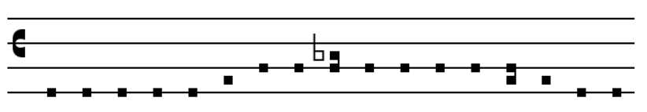

# GregJS

GregJS is a Javascipt library for displaying Gregorian chant.

## Overview

GregJS organizes chant into phrases, each of which contain a sequence
of neumes. To render a phrase, call `renderPhrase` with a string
argument representing the neumes.

Neumes are a set of notes that are written together. When written in
GregJS's concrete syntax, a neume is either a single note or a
parenthesized sequence of notes.

Notes consist of a pitch and a duration.

Pitches are the letter names `a` through `g` plus the special `bes`
for B flat. GregJS currently only supports one kind of clef, which is
a 4-line C clef with C on the third line from the bottom. On this
clef, we consider the pitches to begin at the bottom line (low F) and
end at the top line (high E). Thus each letter name appears exactly
once, so there is no ambiguity or need to specify which octave a pitch
name lives in.

Durations are a number representing the number of beats in the
note. If the duration of a note is omitted, it is assumed to be the
same as the previous note. Currently durations are parsed but ignored.

## Example

To draw the neumes of the Gloria Patri used at the end of the respond
used in the Seattle rite of Compline, you would say:

```
renderPhrase("f1 f f f f g a a (a bes) a a a a (g a) g f f");
```

Note the use of parentheses to group neumes, and of `bes` to indicate
B flat.

This renders as follows:

